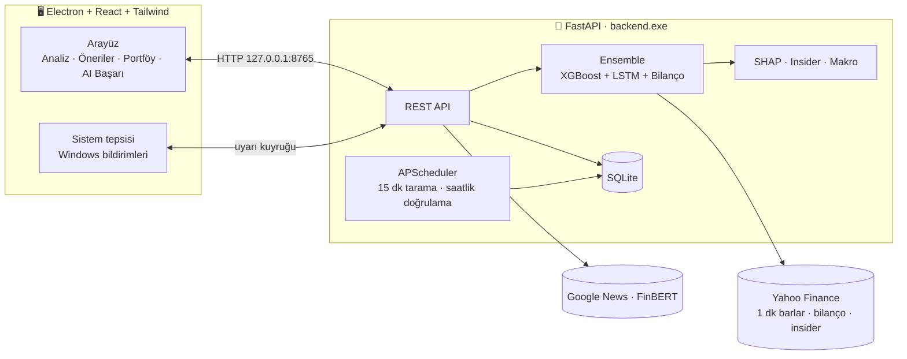

<div align="center">
TOBinance
Yapay zeka destekli, açık kaynak Windows yatırım terminali
Hisse senetleri için 6 farklı vadede yön ve hedef fiyat tahmini · SHAP ile açıklanabilir kararlar · kendi karnesini tutan AI · kademeli portföy takibi


</div>
---
> ⚠️ **Yasal Uyarı:** TOBinance bir araştırma ve eğitim projesidir, **yatırım tavsiyesi değildir.** Hiçbir model piyasayı kesin olarak öngöremez. Uygulamanın ürettiği sinyaller, skorlar ve AL/TUT/SAT önerileri yalnızca bilgilendirme amaçlıdır; yatırım kararlarınızın sorumluluğu size aittir.
✨ Özellikler
	Modül	Açıklama
🔮	Çoklu Vade Tahmini	Yarın, 1 Hafta, 1 Ay, 3 Ay, 6 Ay ve 1 Yıl için ayrı ayrı yön, hedef fiyat bandı (%10–%90) ve 1–100 güven skoru
🧠	Ensemble AI	XGBoost (teknik) + LSTM (zaman serisi) + bilanço skorlama. Üç model aynı yönü göstermezse sinyal "Düşük İhtimal" olarak elenir
📈	Projeksiyon Grafiği	Geçmiş fiyat (düz çizgi) ve bugünden uzanan AI tahmin yolu (kesikli neon çizgi) aynı grafikte
🔬	Karar Röntgeni (SHAP)	Hangi indikatörün kararı ne kadar etkilediğini gösteren yeşil/kırmızı şelale grafiği
🕵️	Patron Radarı	İçeriden öğrenen (insider) işlemleri; yöneticiler yoğun satış yapıyorsa kırmızı bayrak kalkar ve modele yansır
📊	AI Başarı Raporu	Her tahmin kaydedilir, hedef tarihte gerçek fiyatla otomatik doğrulanır. Kazanma oranı, hata payı, skor kalibrasyonu
💼	Portföy & Temettü	Kademeli alım, ağırlıklı ortalama maliyet (tam rasyonel aritmetik), K/Z, yıllık pasif gelir projeksiyonu
🎯	AI Aksiyonu	Portföydeki her hisse için 🟩 AL / 🟨 TUT / 🟥 SAT önerisi ve bilanço bazlı vade önerisi
🌡️	Makro Piyasa Sağlığı	VIX, S&P 500 ve BIST 100. Piyasa riskten kaçış modundayken alım sinyalleri cezalandırılır
⚡	Canlı İzleme	1 dakikalık barlardan önbelleksiz fiyat, yanıp sönen fiyat rozetleri, seans durumu (açık/kapalı/tatil)
📰	Haber Duyarlılığı	Haber başlıkları FinBERT (İngilizce) ve Türkçe BERT ile Pozitif/Negatif/Nötr olarak etiketlenir
🏆	AI Önerileri	Yakın, orta ve uzun vade için 5'er hisselik öneri kartları (ABD ve BIST)
🔔	Akıllı Uyarılar	Zarar kes, kâr al ve güçlü düşüş sinyali için Windows bildirimi. Uygulama sistem tepsisindeyken de çalışır
Hem ABD (AAPL, NVDA…) hem Borsa İstanbul (THYAO.IS, ASELS.IS…) hisseleri desteklenir. `THYAO` yazarsanız `.IS` soneki otomatik eklenir.
🚀 Hızlı Başlangıç
Kullanıcılar için
Releases sayfasından `TOBinance-Setup.exe` dosyasını indirip çift tıklayın. Kurulum ekranı yoktur: uygulama saniyeler içinde kurulur ve açılır. Python veya Node.js gerekmez.
> İmzasız uygulama olduğu için Windows SmartScreen uyarı verebilir: **Ek bilgi → Yine de çalıştır**.
Geliştiriciler için
Gereksinimler: Windows 10/11 · Python 3.11 veya 3.12 (kurulumda "Add python.exe to PATH" işaretli olmalı) · Node.js 20+
```bat
git clone https://github.com/<kullanici-adi>/TOBinance.git
cd TOBinance
start.bat
```
Hepsi bu. `start.bat` ilk çalıştırmada eksik npm paketlerini, Python sanal ortamını ve yapay zeka kütüphanelerini (PyTorch dahil) otomatik kurar. İlk kurulum 5–15 dakika sürer; sonraki açılışlar saniyelerdir. Ardından FastAPI sunucusu ile Electron arayüzü birlikte başlar.
<details>
<summary>Terminal komutlarıyla</summary>
```bat
npm install            :: başlatıcı paketleri
npm start              :: kontrol + otomatik kurulum + API ve arayüzü birlikte başlat
npm run setup          :: yalnızca kurulum/onarım
npm run setup:force    :: sanal ortamı silip sıfırdan kur
```
API belgeleri, arka yüz çalışırken şu adreste: http://127.0.0.1:8765/docs
</details>
📦 Kurulum Dosyası Üretmek (TOBinance-Setup.exe)
```bat
:: 1) Ortamı hazırla
npm install
npm run setup

:: 2) Python backend'ini backend.exe'ye paketle (PyInstaller + otomatik duman testi)
backend\build_backend.bat

:: 3) Arayüzü derle ve tek tık kurulum paketini oluştur (electron-builder NSIS)
npm run build:ui

:: Sonuç → release\TOBinance-Setup.exe
```
Tek komut isterseniz: `build_windows.bat`
🏗️ Mimari

<details>
<summary>Klasör yapısı</summary>
```
TOBinance/
├── start.bat                   # Tek tıkla: otomatik kurulum + başlatma
├── build_windows.bat           # Tek komutla release\TOBinance-Setup.exe
├── package.json                # npm start / setup / dist komutları
├── scripts/                    # Kurulum ve başlatma betikleri (Node)
├── backend/                    # Python · FastAPI · AI
│   ├── main.py                 # API uç noktaları
│   ├── ensemble.py             # Model birleştirme + güven skoru
│   ├── technical_model.py      # XGBoost (vade başına)
│   ├── lstm_model.py           # PyTorch LSTM (6 vade tek modelde)
│   ├── fundamental_model.py    # Bilanço skorlama
│   ├── explain.py              # SHAP
│   ├── insider.py              # Patron radarı
│   ├── performance.py          # Tahmin kaydı ve doğrulama
│   ├── portfolio.py            # Ağırlıklı ortalama maliyet
│   ├── advisor.py              # Vade önerisi + AL/TUT/SAT
│   ├── live.py · quotes.py     # Canlı fiyat ve seans durumu
│   ├── db.py                   # SQLite şeması
│   ├── scheduler.py            # Arka plan görevleri
│   └── build_backend.py/.bat   # PyInstaller paketleme
├── frontend/                   # Electron · React · Tailwind · Recharts
│   ├── electron/main.cjs       # Pencere, tepsi, bildirimler, backend yönetimi
│   └── src/components/         # ProjectionChart, ExplainabilityChart, AiPerformance …
└── docs/
    └── TEKNIK.md               # Ayrıntılı teknik doküman
```
</details>
🧪 Metodoloji: Neden "%90 kesinlik" garantisi yok?
TOBinance, yüksek görünen ama boş sayılar üretmek yerine dürüst olmayı seçer:
Sızıntısız eğitim: Veri kronolojik olarak bölünür. Her vade için etiket sızıntısı engellenir (purge). Geleceği gören göstergeler (ör. Ichimoku Chikou) modele alınmaz.
Kanıta dayalı güven skoru: Skor, modellerin örneklem dışı (backtest) isabetinin istatistiksel alt sınırına (Wilson) bağlıdır. Üç model hizalı değilse skor en fazla 49 olabilir.
"Yüksek Kesinlik" nadirdir: Bu etiket (skor ≥ 90) nadiren oluşur. Uzun vadelerde bağımsız test verisi az olduğu için neredeyse hiç oluşmaz; bu bilinçli bir tasarım kararıdır.
Kendi karnesini tutar: AI Başarı Raporu her tahmini gerçekleşen fiyatla karşılaştırır. Skorların gerçekten işe yarayıp yaramadığını kendi verinizle görebilirsiniz.
Ayrıntılar için: docs/TEKNIK.md
⚠️ Bilinen Sınırlamalar
Gecikmeli veri: Yahoo Finance ücretsiz verisi Borsa İstanbul için ~15 dakika gecikmelidir.
BIST'te eksik veri: İçeriden işlem (insider) verisi yalnızca ABD hisseleri için mevcuttur; KAP desteklenmez.
Sınırlı bilanço geçmişi: Ücretsiz kaynaklar yalnızca son 4–5 çeyreği verir. Bu yüzden temel analiz, geçmişe dönük eğitilen bir model yerine şeffaf bir skorlama modelidir.
İlk haber analizi yavaştır: Haber duyarlılığı modelleri (~850 MB) ilk kullanımda indirilir.
🤝 Katkı
Hata bildirimi ve önerileriniz için Issues sekmesini kullanabilirsiniz. Pull request'ler memnuniyetle karşılanır.
